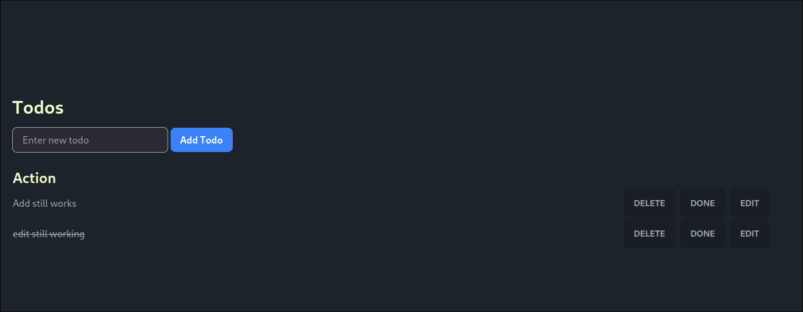

# Go Based Todo Application with an HTMX and tailwindCSS frontend.

Project info:
    Todo management system with postgresql for long time storage.
    Deployed on AWS, using EKS, RDS and ECR, using gitOps principles thakns to ArgoCD
    CI/CD build with github actions, and testcontainers for integration tests

Preview: 

 

To set up locally we can use the docker compose on the SRC folder, and the make build there.

Check the other readme in the folder with specific details for infra and k8s infra.

## Technologies Used
- **Backend:** Go (Golang)
- **Frontend:** HTMX
- **Cloud Services:** Amazon EKS, Route 53, IAM, ECR
- **Infrastructure as Code:** Terraform
- **Deployment Automation:** GitHub Actions, ArgoCD

# Choices made:
    - Go and postgres and htmx
        This provides a really nice pattern to build and app, and htmx makes the comunication very easy with the backend.
    - Separating infra and k8s deployments:
        This has some advantages and disavantages.
            Cons: We have more steps to deploy.
            Pro: It is easier to manage the apps once they are deployed thanks to argocd.

# Learnings from this project
    - Imporved golang and postgres skills
    - Improved aws services ecr eks etc skills..
    - Improved github actions knowledge.

# Things that could be further imrpoved:
    - Looking into using a better realese tactic follow semver or similar.
    - Implement monitoring and tracing with opentelemetry prometheus etc etc.
    - Create ephemeral enviroments for testing.

